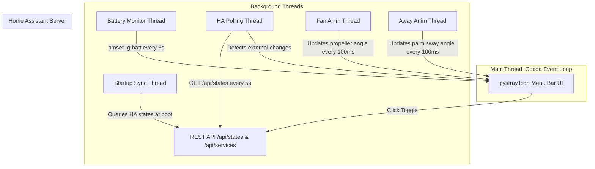

# HA-Minder 🌙💡

A premium, lightweight macOS menu bar application that controls a [Home Assistant](https://www.home-assistant.io/) smart light and office fan directly from your status bar—no browser, no dashboard required. It features automated desk proximity detection, background state synchronization, and a custom-drawn, dynamically animated icon interface.

---

## ⚡ TL;DR: Quick Start & Environment Configuration

HA-Minder uses a robust loading system to locate your credentials. If you are comfortable with the command line, you can configure your settings in **under 2 minutes**.

### 1. Where to Place Your Configuration File
On startup, HA-Minder searches for a configuration file named `.env`, `env.sh`, `env`, or `.haminder.env` in the following directory hierarchy (stopping at the first file found):
1. **Current Working Directory** (where you run the script or where the compiled app bundle resides)
2. **User Home Directory** (e.g., `~/.env`, `~/.haminder.env`, `~/env`, `~/env.sh`)
3. **User Config Folder** (`~/.config/haminder/env`, `~/.config/haminder/.env`, `~/.config/haminder/env.sh`)
4. **Parent Directories** recursively upwards to system root.

> [!TIP]
> **Recommended Production Path**: Create the config directory and save your file at:  
> `~/.config/haminder/env` (This keeps your credentials centralized and safe from accidental repository commits).

### 2. Configuration File Content (`.env`)
Create a file named `.env` in one of the locations above and paste the following variables:

```bash
# ==========================================
# HA-MINDER ENVIRONMENT CONFIGURATION
# ==========================================

# 1. Home Assistant URL (Include port 8123; do not append a trailing slash)
HA_HOST=http://homeassistant.local:8123

# 2. Long-Lived Access Token (Create in HA under: Profile -> Long-Lived Access Tokens)
HA_AUTH=eyJhbGciOiJIUzI1NiIsInR5cCI6IkpXVCJ9.eyJpc3MiOiIzN2QxY...

# 3. Smart Light Entity ID (Controls the main indicator state)
HA_LIGHT_ENTITY=light.office_desk_lamp

# 4. Smart Fan or Switch Entity ID (Controls the spinning propeller state)
HA_FAN_ENTITY=switch.office_fan
```

*Alternatively, you can use the `env.sh` format:*
```bash
export HA_HOST="http://homeassistant.local:8123"
export HA_AUTH="eyJhbGciOiJIUzI1NiIsInR5cCI6IkpXVCJ9..."
export HA_LIGHT_ENTITY="light.office_desk_lamp"
export HA_FAN_ENTITY="switch.office_fan"
```

---

## 🎨 Visual State Showcase

The app dynamically draws pixel-perfect menu bar icons at runtime. Below are the actual rendering behaviors for each system state:

| At Desk: Light OFF, Fan OFF | At Desk: Light OFF, Fan ON (Spinning) | At Desk: Light ON, Fan OFF | At Desk: Light ON, Fan ON (Spinning) | Away From Desk: Laptop Unplugged |
| :---: | :---: | :---: | :---: | :---: |
|  |  |  |  |  |
| **Crescent Moon**<br>Lavender moon core, propeller at rest. | **Breezy Night**<br>Lavender moon core, spinning silver propeller. | **Glowing Sun**<br>Golden core, glowing rays, propeller at rest. | **Breezy Day**<br>Propeller colored dark-blue inside and white outside the sun. | **Spyglass Beach Scene**<br>Swaying palm trees with dynamic sun, sand & ocean. |

---

## 🛠️ Execution & Deployment Modes

You can run HA-Minder in two different modes depending on your preference.

### Option A: Running as a Python Script (Developer Mode)

For quick testing or running directly in the terminal, activate your virtual environment and run the main script:

```bash
# 1. Clone the repository and navigate to its directory
cd haminder

# 2. Initialize a Python virtual environment
python3 -m venv .venv

# 3. Activate the virtual environment
source .venv/bin/activate

# 4. Install high-performance dependencies (Pillow, requests, python-dotenv)
pip install -r requirements.txt

# 5. Run the application
python haminder.py
```

---

### Option B: Packaging and Installing as a macOS Desktop App

To bundle HA-Minder as a standalone macOS application (`HA-Minder.app`) that resides permanently in your menu bar and hides entirely from the macOS Dock:

```bash
# 1. Compile the app using the automated build script (uses py2app)
./build.sh
```

The script cleans up previous artifacts and generates a compiled macOS package at `dist/HA-Minder.app`.

#### ⚠️ Critical Installation Step
Because macOS packages contain nested Python and Tk/Tcl framework symlinks, overwriting an existing bundle directly using simple copy commands throws directory conflicts. 

To install or update the app in your system `/Applications` directory, always run the following command sequence:

```bash
# Remove any existing bundle and ditto the new one safely to /Applications
rm -rf /Applications/HA-Minder.app && ditto dist/HA-Minder.app /Applications/HA-Minder.app

# Open the application
open /Applications/HA-Minder.app
```

*Note: The built `.app` utilizes the `LSUIElement` key in its `Info.plist` (configured via `setup.py`), ensuring that it launches as a pure status bar menu utility with **no Dock icon**.*

---

## 🧠 System Architecture & State Machine

HA-Minder is built with standard Python and macOS AppKit libraries. It coordinates multiple background threads to ensure the UI stays buttery-smooth and never blocks the macOS main loop.

### 1. Thread Architecture Flowchart



### 2. Desk Proximity & Power State Transition Machine

When you unplug your MacBook's power cable, the app assumes you have walked away from your desk. It automatically saves your active states, shuts down your office light and fan in Home Assistant, and shows an animated tropical spyglass scene. Plugging back in instantly restores the saved device states.

```mermaid
stateDiagram-v2
    [*] --> Startup: Launch App
    Startup --> InitialSync: Run initialize_device_states()
    InitialSync --> CheckPower: Query pmset -g batt
    
    state "At Desk Mode (Plugged In)" as AtDesk {
        [*] --> LightOff_FanOff: Moon Icon
        LightOff_FanOff --> LightOn_FanOff: Light Toggle (Sun)
        LightOff_FanOff --> LightOff_FanOn: Fan Toggle (Moon + Spin)
        LightOn_FanOff --> LightOn_FanOn: Fan Toggle (Sun + Spin)
        LightOff_FanOn --> LightOn_FanOn: Light Toggle (Sun + Spin)
    }

    state "Away Mode (Battery Power)" as Away {
        [*] --> SwayingPalm: Swaying Tropical Beach Scene
        note right of SwayingPalm
            - Menu bar interactions disabled
            - HA Light & Fan turned OFF automatically
            - HA external state changes tracked in history
        end note
    }

    CheckPower --> AtDesk: AC Power Detected
    CheckPower --> Away: Battery Power Detected

    AtDesk --> Away: Unplugged (AC -> Battery)
    note on link
        - Saves current states
        - Shuts down HA devices
        - Starts swaying tree
    end note
    
    Away --> AtDesk: Plugged In (Battery -> AC)
    note on link
        - Restores saved states
        - Toggles HA devices back ON
    end note
```

---

## 💎 Advanced Features & Implementation Details

* **Auto-Polling Synchronization**: A background thread checks Home Assistant's REST API every 5 seconds. If you toggle your office light or fan via your physical wall switch, your HA Dashboard, or your mobile app, the macOS menu bar icon syncs automatically within seconds!
* **Main Thread Safety**: Status bar apps on macOS require status items to be modified and drawn strictly on the main thread. HA-Minder is built with careful thread-locking and non-blocking asynchronous requests to prevent application freezes or Cocoa-AppKit thread crashes.
* **Aspect Ratio Preservation**: The dynamic generator draws on a 64x64 square canvas to maintain standard macOS 1:1 button aspect ratios and prevent image stretching.
* **Sleep/Wake Observer**: AppKit observers capture `NSWorkspaceWillSleepNotification` and `NSWorkspaceDidWakeNotification` events. When your computer goes to sleep, HA-Minder shuts down your devices; when your laptop wakes, it restores them seamlessly.
* **Robust Configuration Fail-safe**: If the configuration is missing, HA-Minder triggers a critical native macOS AppleScript alert dialog explaining the missing environment variables, ensuring direct developer feedback.

---

## 📄 License

This project is licensed under the MIT License. See the [LICENSE](LICENSE) file for details.
